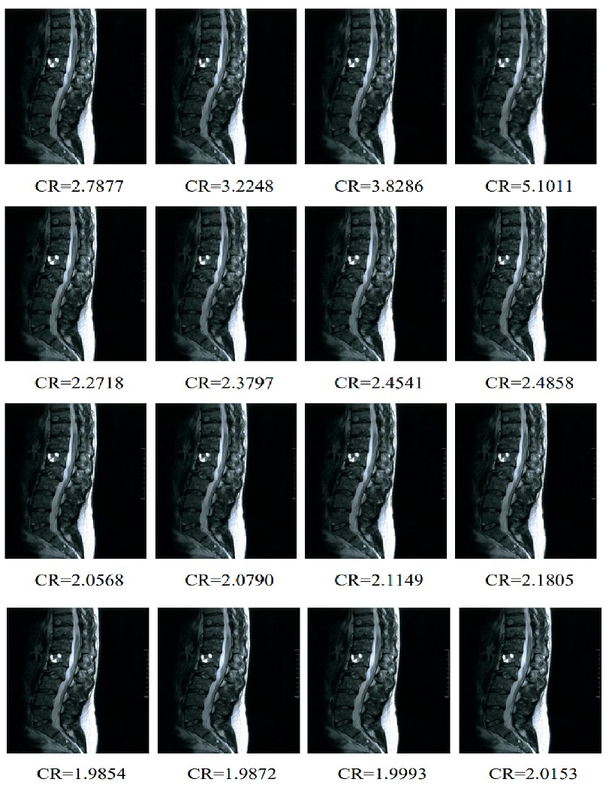
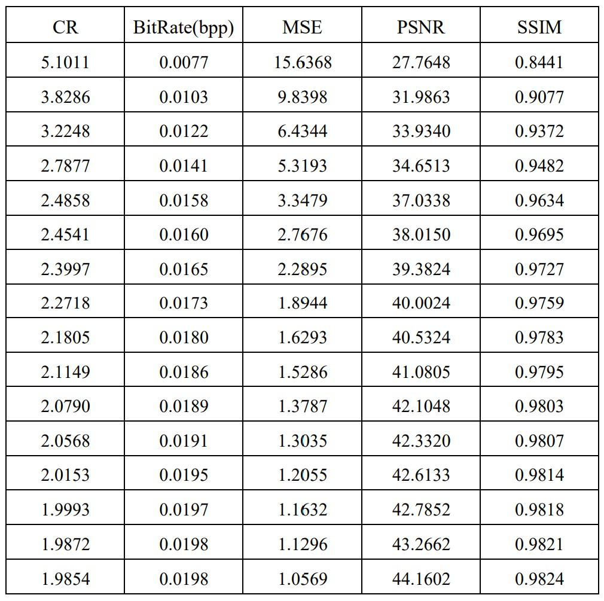

 # Discrete Cosine Transform (2-D discrete cosine transform)
 
 B = dct2(A) returns the two-dimensional discrete cosine transform of A. The matrix B contains the discrete cosine transform coefficients B(k1,k2).
 
 # Visual Results
 16 images compressed from an MRI image with dct2.
 
  * CR (Compression ratio)
  

    
  

# Quantitative Results
 * BitRate (Bit per pixel rate-bpp)
 
 * MSE (Mean square error) 
   
 * PSNR (Peak to signal noise ratio)
   
 * SSIM (Structural similarity index measure)
  

   
  

