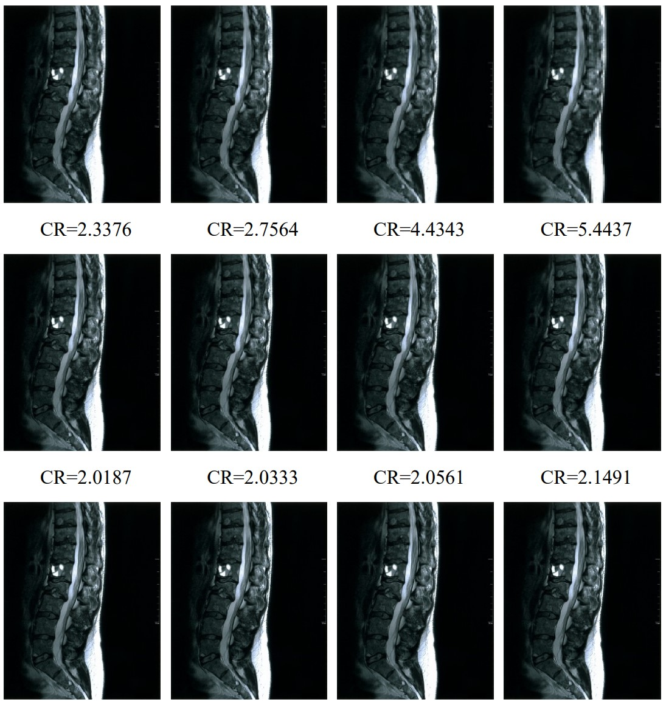
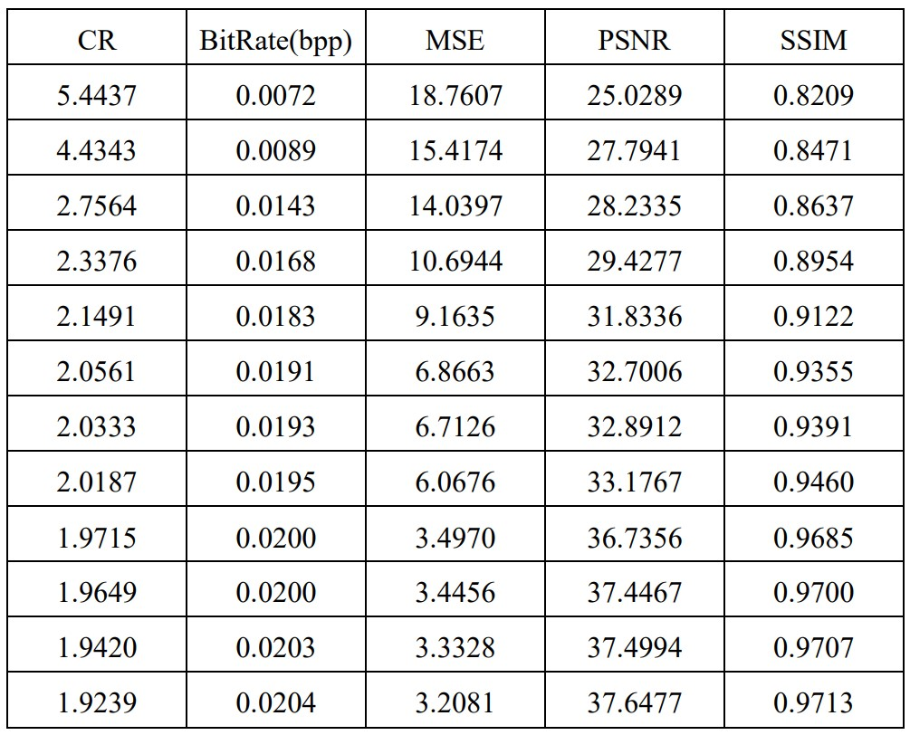

 
 # Discrete Wavelet Transform (Single-level discrete 2-D wavelet transform)
 
 dwt2 computes the single-level 2-D wavelet decomposition. Compare dwt2 with wavedec2 which may be more useful for your application. The decomposition is done with respect to either a particular wavelet (see wfilters for more information) or particular wavelet decomposition filters.
 
 # Visual Results
 12 images compressed from an MRI image with dwt2.
 
  * CR (Compression ratio)
  

    
  

# Quantitative Results
 * BitRate (Bit per pixel rate-bpp)
 
 * MSE (Mean square error) 
   
 * PSNR (Peak to signal noise ratio)
   
 * SSIM (Structural similarity index measure)
  

   
  

