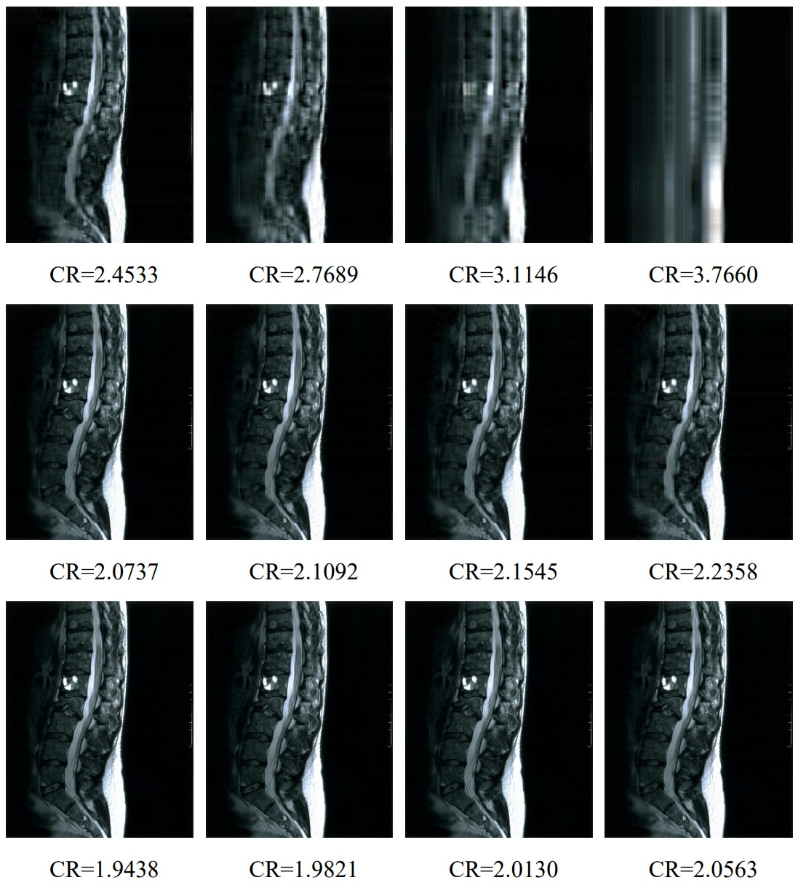
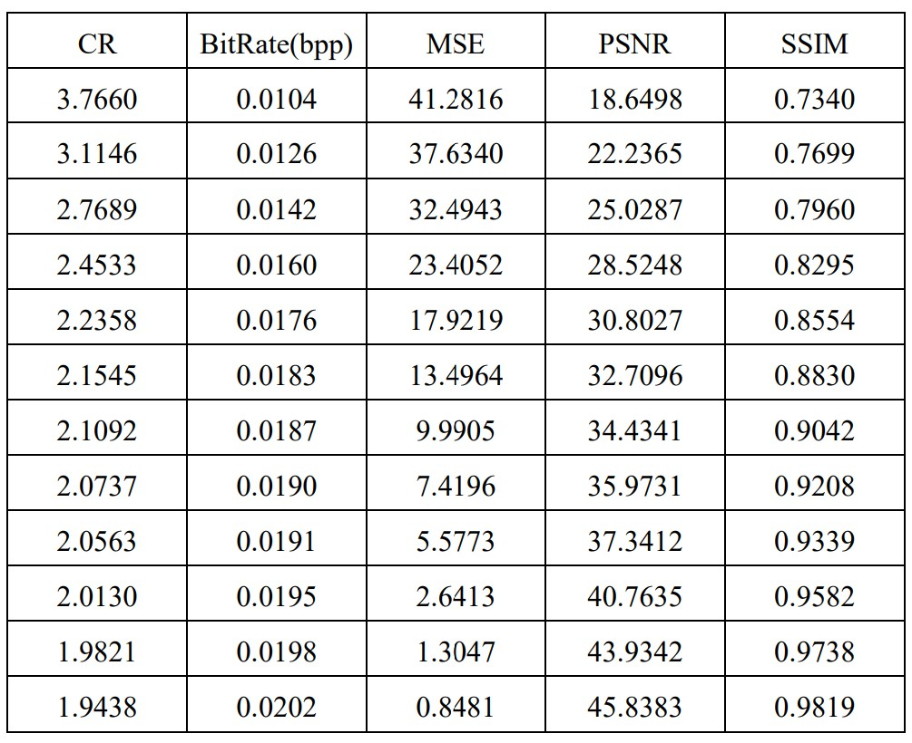

 # Principal Component Analysis
 
 PCA is an algorithm that attempts to reduce the dimensionality within a data while still retaining as much information as possible and in this MATLAB code, we implemented the image compression with PCA. 
 
 
 # Visual Results
 12 images compressed with PCA.
 
  * CR (Compression ratio)
  

    
  

# Quantitative Results
 * BitRate (Bit per pixel rate-bpp)
 
 * MSE (Mean square error) 
   
 * PSNR (Peak to signal noise ratio)
   
 * SSIM (Structural similarity index measure)
  

   
  

