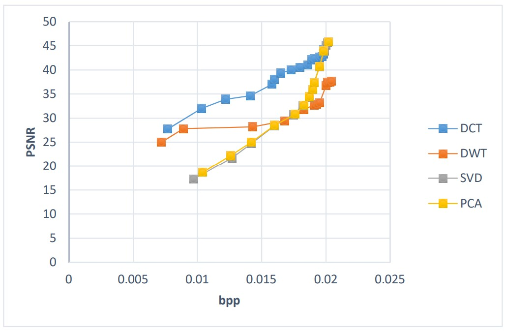

# image-compression-algorithm
Different image compressions method - Image processing project

In this project, four simple image compression algorithms were implemented with MATLAB code.

* Singular Value Decomposition
* Principal Component Analysis
* 2D-Discrete Wavelet Transform
* 2D-Discrete Cosine Transform

# Comparison

 * MSE (Mean square error) 
   
 * PSNR (Peak to signal noise ratio)
   
 * SSIM (Structural similarity index measure)

  

     
  

  
  

       
    

         DCT &nbsp; &nbsp; &nbsp; &nbsp; &nbsp; &nbsp; &nbsp; &nbsp; &nbsp; &nbsp; &nbsp; &nbsp; &nbsp; &nbsp; DWT &nbsp; &nbsp; &nbsp; &nbsp; &nbsp; &nbsp; &nbsp; &nbsp; &nbsp; &nbsp; &nbsp; &nbsp; &nbsp; SVD &nbsp; &nbsp; &nbsp; &nbsp; &nbsp; &nbsp; &nbsp; &nbsp; &nbsp; &nbsp; &nbsp; &nbsp; &nbsp; PCA &nbsp; 
    

  

