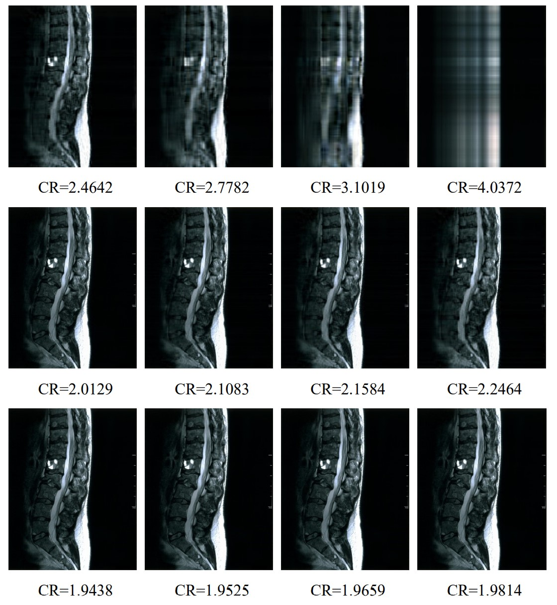
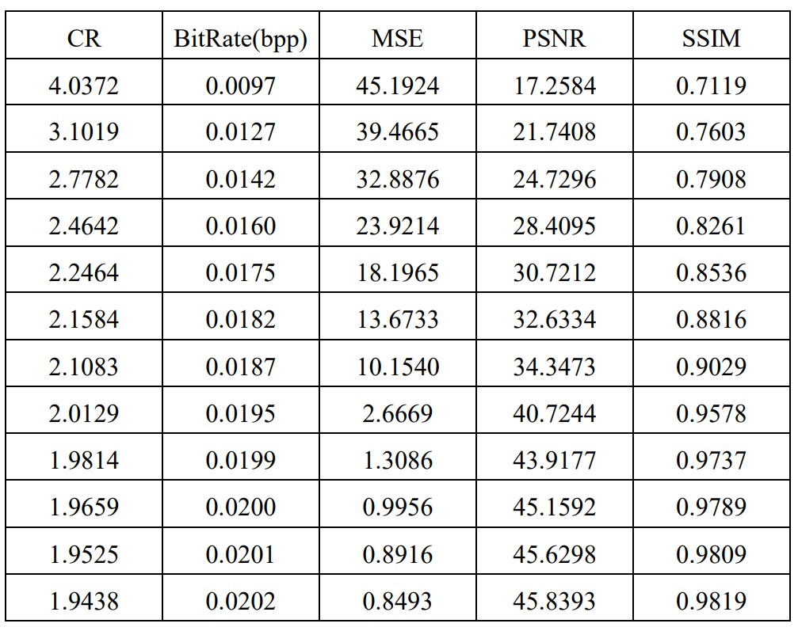

 # Singular Value Decomposition
 
Singular value decomposition (SVD) is a matrix factorization method that generalizes the eigendecomposition of a square matrix (n x n) to any matrix (n x m) (source).
 
 
 # Visual Results
 12 images compressed from an MRI image with SVD.
 
  * CR (Compression ratio)
  

    
  

# Quantitative Results
 * BitRate (Bit per pixel rate-bpp)
 
 * MSE (Mean square error) 
   
 * PSNR (Peak to signal noise ratio)
   
 * SSIM (Structural similarity index measure)
  

   
  

